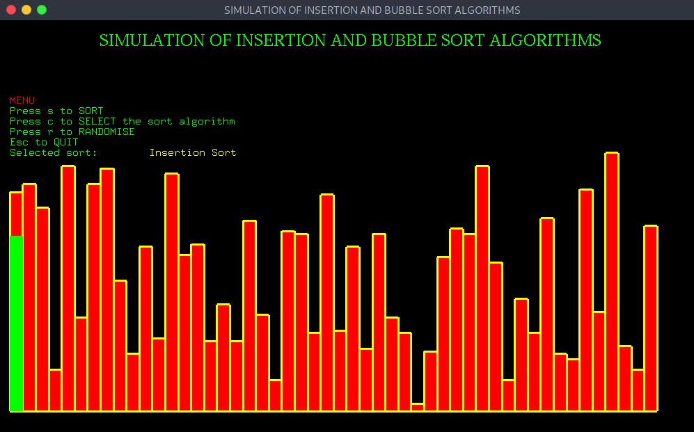

# CGV PROJECT

## Simulation of Insertion and Bubble sort Algorithm - OpenGL

This project is about the visual representation which
demonstrates the working of Insertion Sort and Bubble Sort
Algorithms.

### Flow Chart

### Home Page

### Unsorted Data - Bubble Sort

### After implementing Bubble Sort

### Unsorted Data - Insertion Sort

### After implementing Insertion Sort

